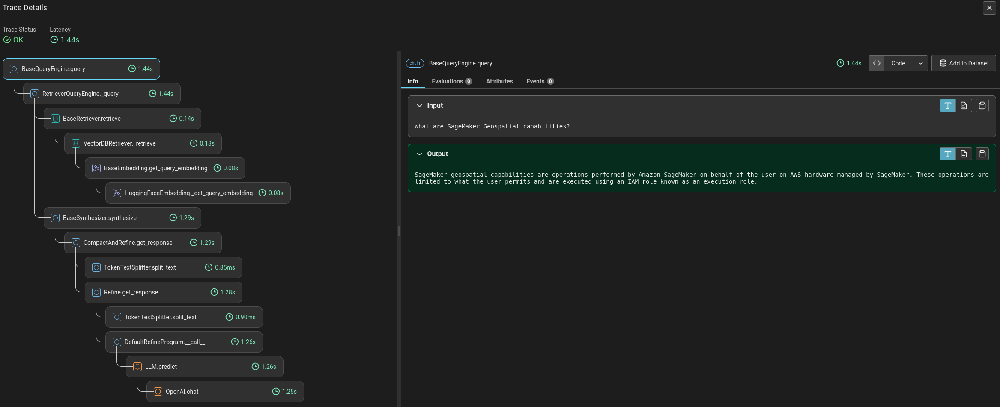

# Rag Pipelines

## Implementation

### Ingestion

### Ingest AWS Data
- For the POC: We'll consume the information directly from the provided files.

- For the Complete Implementation: The data should be consumed from the source. If required by the client, this information can be uploaded to an S3 bucket in an AWS US region. and implement a stategy for the information udpate. That can be:

    - Create Lambda, SNS, or SQS service in AWS that will receive events from S3 bucket
    - S3 bucket with the right permissions and create Event Notifications for the events. ObjectCreated (update) events and ObjectRemoved events.
    - When an event is recieved run the RAG ingestor pipeline.
        - Create Take the file, embed, chunk, and store it in the vector db.
        - Update check what has already been maintain metadata of the files processed or query directly from the vector db.
        - Delete. Modify the vectors associated with that particular file for which you received an event for
### Embedding
- To make the text usable for a large language model (LLM), we first need to embed it and then store it.
- For embedding, we'll use the model BAAI/bge-small-en from Hugging Face. This model can be easily interchanged based on performance or client requirements.
### Indexing
- We'll use a vector database to store and index the parsed documentation.
- For the POC, we will use a local vector PostgresDB.

## Inference
### Query Processing (optional)
- Query Understanding:
    - Use a pre-trained NLP model (e.g., BERT) to understand and process user queries.
    - Ensure the model can handle variations in query phrasing and context.
### Retriever
- Information Retrieval:
    - Implement a retriever that leverages the vector database to find and extract relevant information.
    - Use the embeddings to match queries with the most relevant documents.
    - Retrieve contextually appropriate sections of the documentation based on the query.
### Answer Generation
- Response Generation:
    - Once the retriever has identified the relevant sections of the documentation, these sections are passed to the LLM for processing.
    - The LLM takes the raw text and parses it to understand the context and extract the most pertinent details that directly answer the user’s query.

    - The LLM uses its understanding of natural language and the context provided by the retrieved documents to generate a concise, accurate answer.
    - The model ensures that the answer is coherent, grammatically correct, and contextually relevant to the user’s query.
### Contextual Recommendations
- Further Reading:
    - Provide links to the source documentation for more detailed information.
    - Suggest related documents or sections that may be relevant to the user's query.

## RAG Architecture

## Technical Documentation for a RAG Pipeline using PostgreSQL, FastAPI and Phoenix

### Introduction
This section provides a comprehensive guide to setting up and running a RAG (Retrieve, Analyze, and Generate) pipeline using PostgreSQL as the vector database, FastAPI as the backend, and Docker Compose for local orchestration.

### Prerequisites
Before starting, ensure you have the following software installed:

Docker: https://docs.docker.com/get-docker/

### PostgreSQL Vector Database.

We use PostgreSQL as our vector database. The db/init.sql file contains the SQL commands to create the necessary database schema. The image `ankane/pgvector` is used.

### FastAPI Backend.

The app/main.py file contains the FastAPI application. It includes the API endpoints for retrieving, analyzing, and generating data. The app/requirements.txt file lists the Python dependencies for the FastAPI application. The app/Dockerfile is used to build a Docker image for the FastAPI application.

### Phoenix.

Phoenix is an observability framework that allows for comprehensive monitoring and analysis of systems, enabling efficient troubleshooting, performance optimization, and overall improved management of the indexing and querying processes. The image `arizephoenix/phoenix:latest` is used and the traces are sent via http to the port 6006.

### Docker Compose
We use Docker Compose to orchestrate the PostgreSQL and FastAPI services. The docker-compose.yml file defines these services and their dependencies.

### Setup Instructions
1. Set the env variables needed in a .env file at the root of the project.

`OPENAI_API_KEY="YOUR KEY"`

`MISTRAL_API_KEY="YOUR KEY"`

`POSTGRES_USER="user"`

`POSTGRES_PASSWORD="password"`

`POSTGRES_DB="vector_db"`

`POSTGRES_HOST="db"`

`POSTGRES_PORT=5432`

1. Build the Docker images:

`docker-compose build`

2. Start the services:

`docker-compose up`

### Usage
Once the services are up and running, you can access the FastAPI application at http://localhost:8080. The PostgreSQL database will be accessible at postgres://localhost:5432. And phoenix tracing http://localhost:6006

### API Endpoints
The following API endpoints are available:

- GET /ingest_data: Get the information from a given path and update the vector store
- GET /query: Ask any question based on the information provided in the previous step, and select the LLM model, right now we have avalaible
    - MistralAI
    - GPT 3.5 turbo
    - GPT 4.0

# Results
Below the pipelines and results for the propose questions are shown.

In the Phoenix framework we can check each query made by the users, how much it took and the whole trace of the query.

Here the trace is shown, how the retrieve query is call then vector db retriever with the hugging face model embedder.

Selected document based on embedding proximity

Prompt template with query and context with output for `chatgpt 3.5-turbo`

Prompt template with query and context with output for `Mistral`

### Answer to proposed questions

## Vector store

Vector store in Postgres local DB with the embedding inserted.

